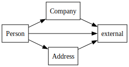

# lib-visualizer
Tool to visualize the internal dependencies of a library

Make sure [Graphviz](https://graphviz.org) is installed and that the 'dot' tool is in the path

## Instructions:

    nm -C library_of_interest.a > nm.txt
    ./lib-visualizer.py -i nm.txt -o outputfile

Open outputfile.svg in your web browser or other tool

## Example output

## Background
A static library is just an archive of object files (compiled code).
If you have an archive with object files that have inter dependencies this
tool will generate a Graphiviz (dot tool) graph of the contents and their dependencies.
